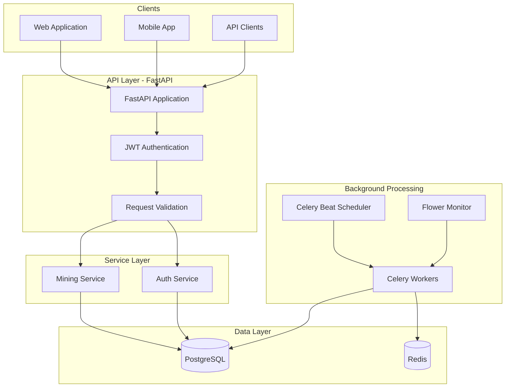
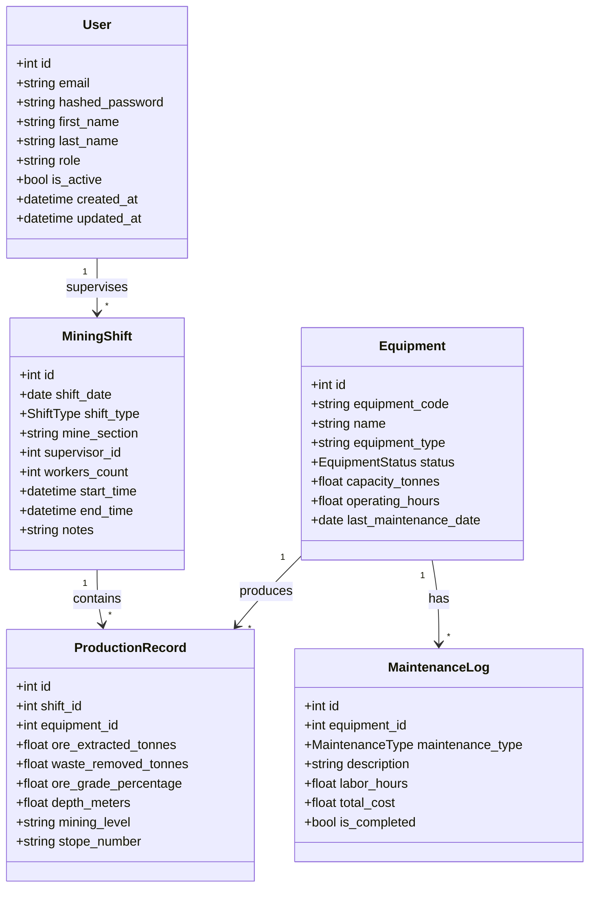
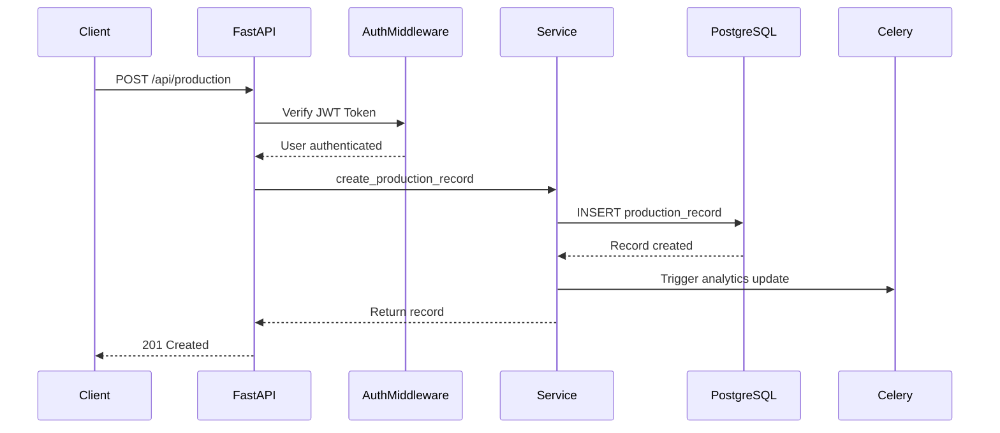
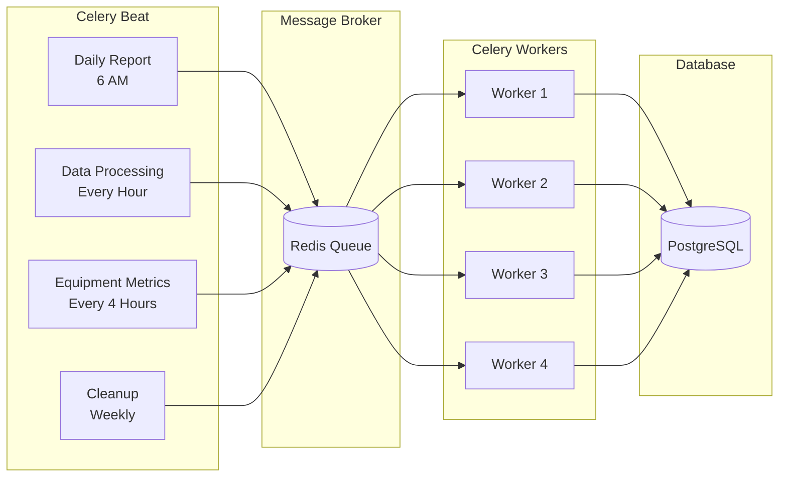
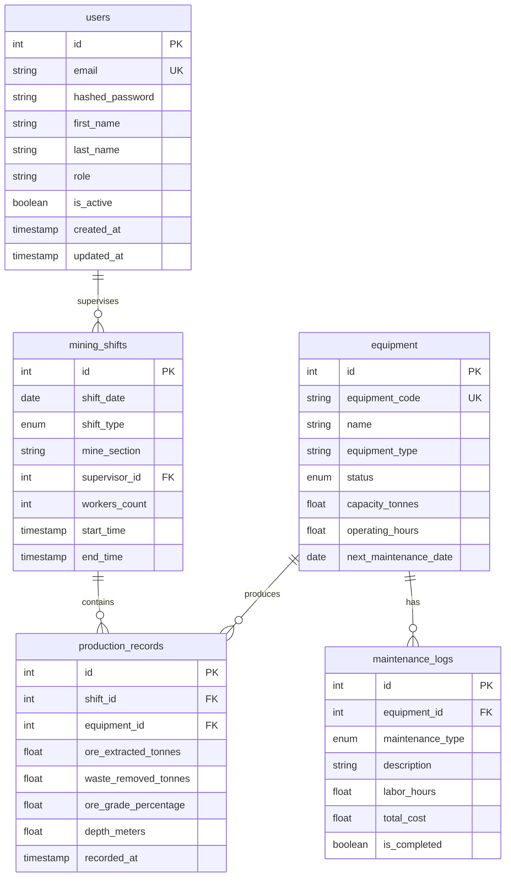
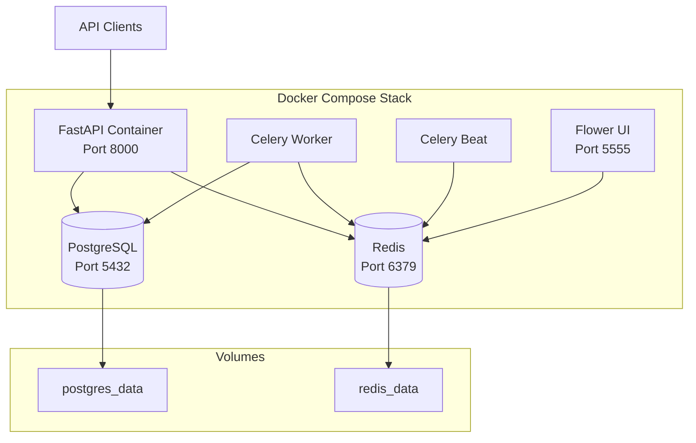

# EIO2 Python - Architecture Documentation

## CSIR EOI 8119 - Mining Data Analytics API

### System Architecture

### Class Diagram - Database Models

### API Request Flow

### Background Task Architecture

### Database Schema (ERD)

### Deployment Architecture

